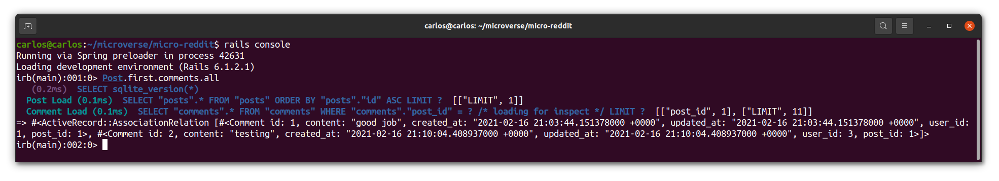

# Micro-reddit

> In this project we learned about active record by creating models and modifying migrations files, create associations between models and tested it using the rails console.

We built a reddit replica which works within the rails console only.
You are able to create users, that are able to create posts and coment on those posts.
## Built With
- Ruby version 3.0.0
- Ruby on Rails 6.1.2.1

## Getting Started
To get a local copy up and running follow these simple example steps.

### Prerequisites
- Linux/Mac Operating systems

### Setup
1. Open your terminal or command prompt.
2. If you don’t have git installed in your system, skip this step and go to step 3. If you do have git installed in your system, clone this repository to your computer in any directory you want by copying this text into your command prompt/terminal: `git clone https://github.com/carloso0114/micro-reddit.git`  .
 Now go to "Install" section
3. If you don’t have git installed in your system, you can download the program files. To do this, click on the green button that says “**Code**“, on the upper right side of the project frame.
4. You will see a dropdown menu. Click on “**Download ZIP**“.
5. Go to the directory where you downloaded the **ZIP file** and open it. Extract its contents to any directory you want in your system.

### Install
1. If you are not in your system terminal/command prompt already, please open it and go to the directory where you cloned the remote repository or extracted the project files.
2. While in the root directory, type `bundle install`. This will install all the necessary gems in your system.
3. Then you can type <code>yarn install --check-files</code>.
4. Now type <code>bin/rails db:migrate</code> to migrate the database.
### Usage
1. Run <code>bin/rails console</code>.
2. Create a user first using <code>User.create(username:"YourUserNameHere")</code>
3. Check how many users you have created by writing <code>User.all</code>, you should be able to see your newly created user.
4. Create a post using <code>Post.create(link: "www.YourPageHere.com", user_id: 1)</code> where 1 is the user_id of the user you have just created.
5. Check the post by using <code>User.first.posts.all </code> this will return the post that the user_id 1 did.
6. Create a new user again using the step number 2. (This will create a user_id 2)
7. Create a comment on the first post using the second user by typing <code> User.second.comments.build(post_id: 1, content: "this is awesome")
8. Check the comments made using <code> Post.first.comments.all </code>. Now you should see the comment that you just created on the first post.

## Authors

👤 **Arturo Alvarez**

- GitHub: [@StarSheriff2](https://github.com/StarSheriff2)
- Twitter: [@ArturoAlvarezV ](https://twitter.com/ArturoAlvarezV )
- LinkedIn: [Arturo Alvarez](https://www.linkedin.com/in/arturoalvarezv/)

👤 **Carlos Ospina**

- GitHub: [@carloso0114](https://github.com/carloso0114)
- LinkedIn: [Carlos Ospina](https://www.linkedin.com/in/carlosospina/)

## 🤝 Contributing

Contributions, issues, and feature requests are welcome!

Feel free to check the [issues page](https://github.com/carloso0114/micro-reddit/issues).

## Show your support

Give a ⭐️ if you like this project!

## Acknowledgments

-RoR official docs  
https://api.rubyonrails.org/classes/ActiveRecord/Migration.html

- The Odin Project 
https://www.theodinproject.com/courses/ruby-on-rails/lessons/building-with-active-record-ruby-on-rails
## 📝 License

This project is [MIT](https://github.com/carloso0114/micro-reddit/blob/feature-micro-reddit/LICENSE) licensed.
